Creo els arxius (hi haurán canvis tant al codi com el nom dels arxius ja que els adaptaré a com m'agrada estructurar i nombrar el meu codi, ús de PascalCase i altres coses menys importants)

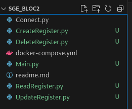

Creo la mini llibreria (realment sól és 1 funció) per connectar-nos a la base de dades a través de la llibreria de psycopg2 (la funció retorna un objecte de connexió per interactuar amb la database amb el que podem utilitzar en altres scripts)

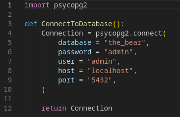

També m'aseguro de que el docker-compose.yml tingui totes les dades correctes i que siguin les mateixes que les de connect.py

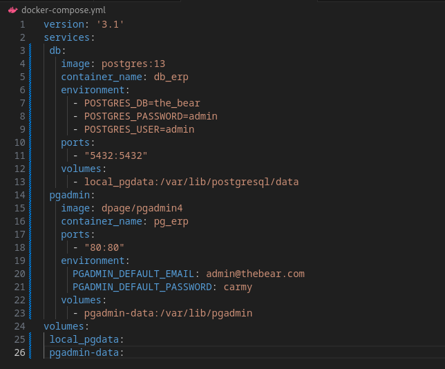

Creo les mini llibreries que necessitem (CreateTableToDictionary, CSVToDictionary, DictionaryToDatabase), CreateTableToDictionary creará la taula a la base de dades, CSVToDictionary pasa un CSV a la estructura de dades d'un diccionari, DictionaryToDatabase transforma un dictionari a la comanda SQL per insertar dades a la base de dades

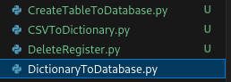

Creo CreateTableToDatabase que simplement crea la taula de clients a la base de dades

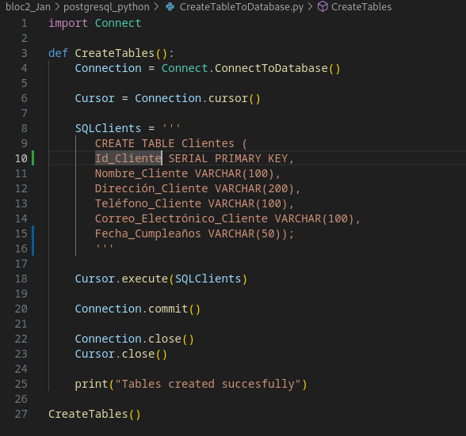

Creo CSVToDictionary llegeix el CSV amb Pandas y el transforma a un dicionari, passant la informació a DictionaryToDatabase per enviar-ho tot a la base de dades

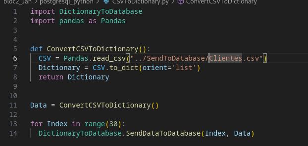

(També he creat la carpeta i descarregat l'arxiu Clientes.csv)

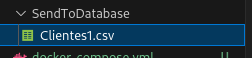

Creo DictionaryToDatabase que transforma el diccionari a una comanda SQL per enviar a la base de dades, indexa a cada client a la taula amb el index que s'envia a través de la funció i inserta tots els valors per el client indicat a la instrucció SQL

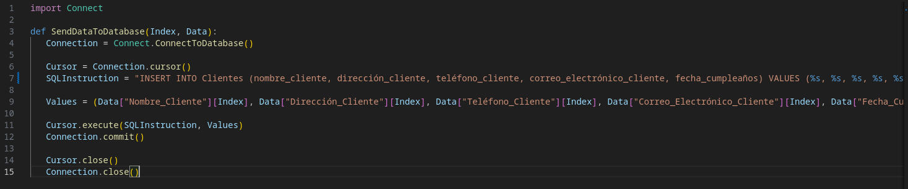

(He corregit l'estructura dels arxius)

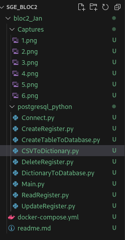

He creat les taules a través del script

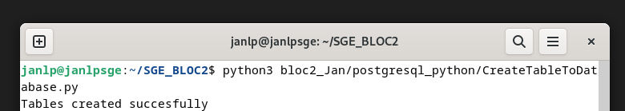
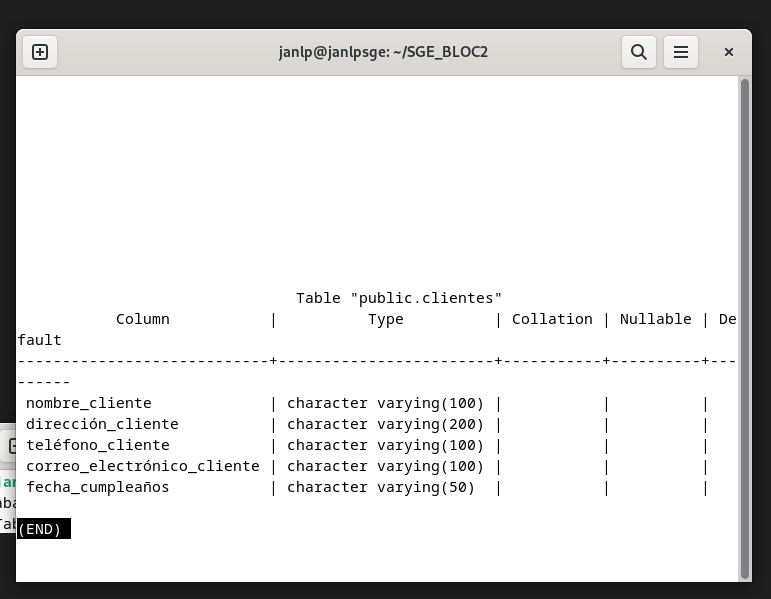

I les he populat

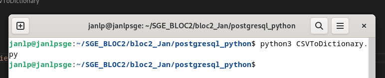
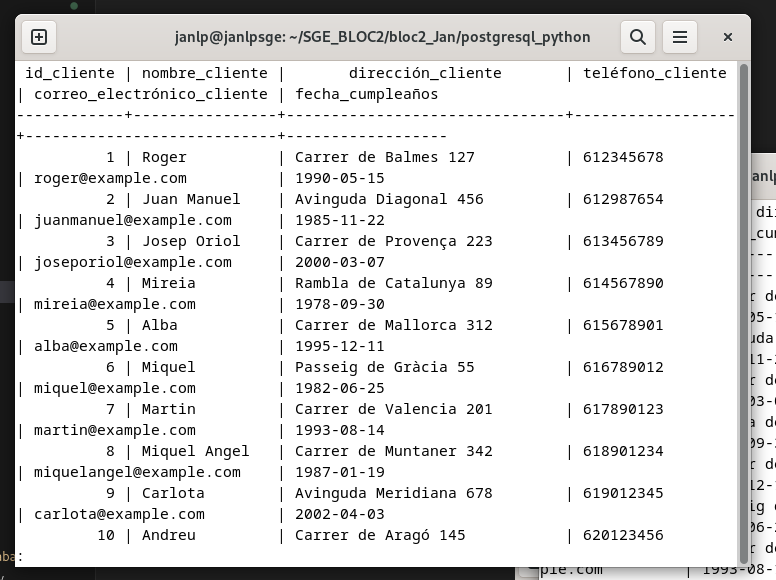

Creo el CreateRegister i modifico Main per probar que funcioni CreateRegister, l'executo i comprovo que s'hagi creat el registre. (podem veure que apareix com l'ultim de la taula)

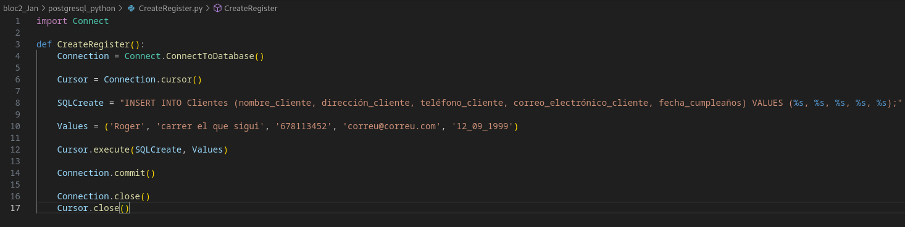
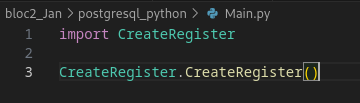
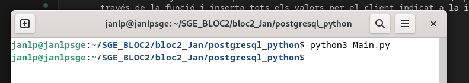
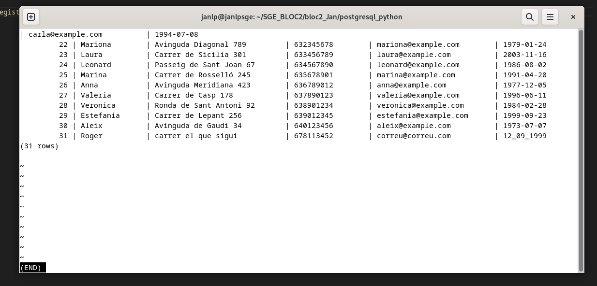

Fico el codi a ReadRegister per llegir tota la taula de Clientes, i he modificat register per que pugui mostrar de forma llegible els resultats.

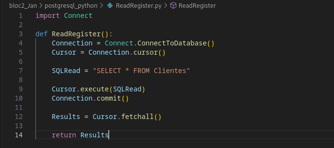
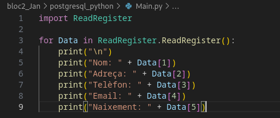
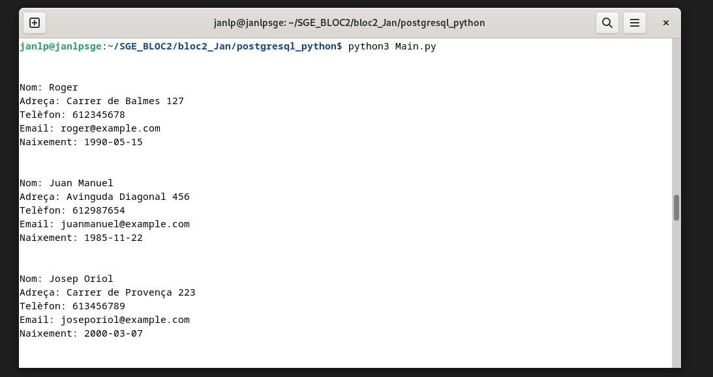

Creo el UpdateRegister per actualitzar la base de dades a través de l'script i utilitzo el Main creat abans per llegir els canvis (hem vist que les captures anteriors han mostrat la informació previa a ser editada, podem veure les diferencies)
(* a partir d'aqui, m'he adonat que la a la taula li falta la id_cliente, he fet les modificacions necesaries, he canviat els scripts i he renovat algunes captures de pantalla per mantenir coherencia)

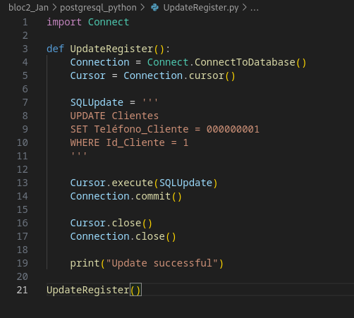
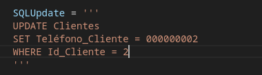
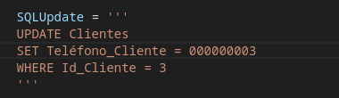
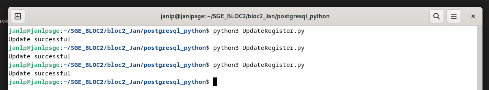
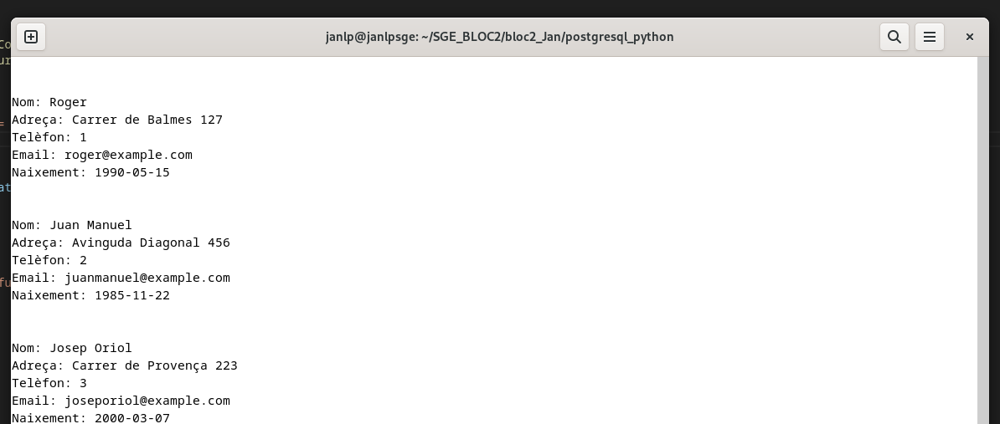

Creo el DeleteRegister per borrar clients de la base de dades i utilitzo el Main creat previament per veure que ja no existeixen els 3 Clients que he canviat amb UpdateRegister

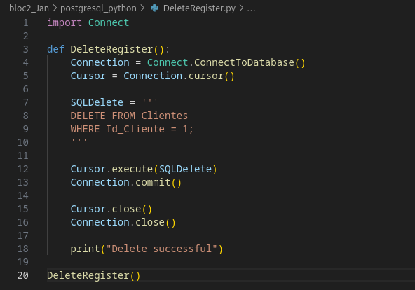

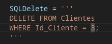
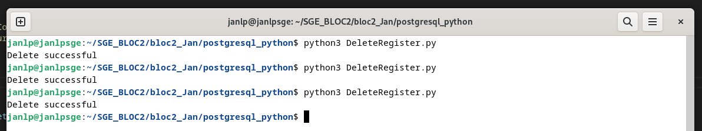
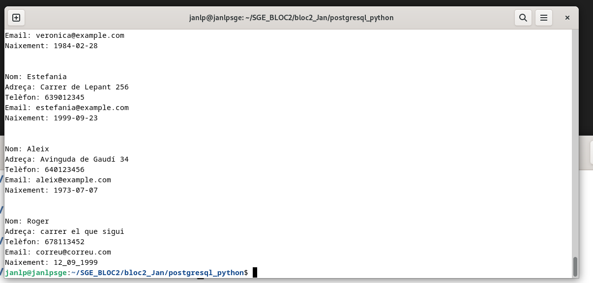